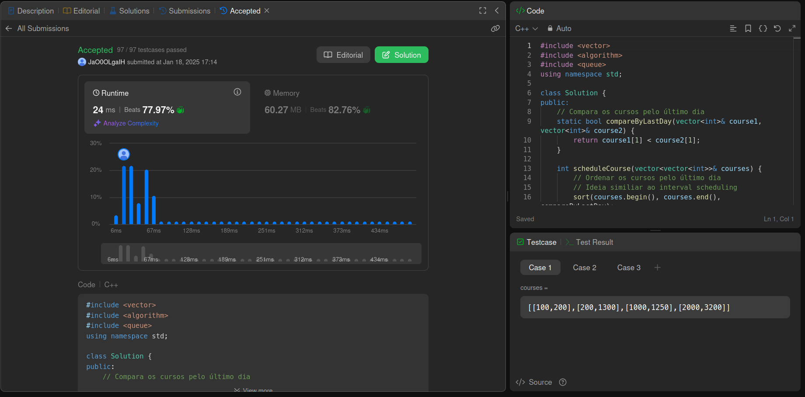
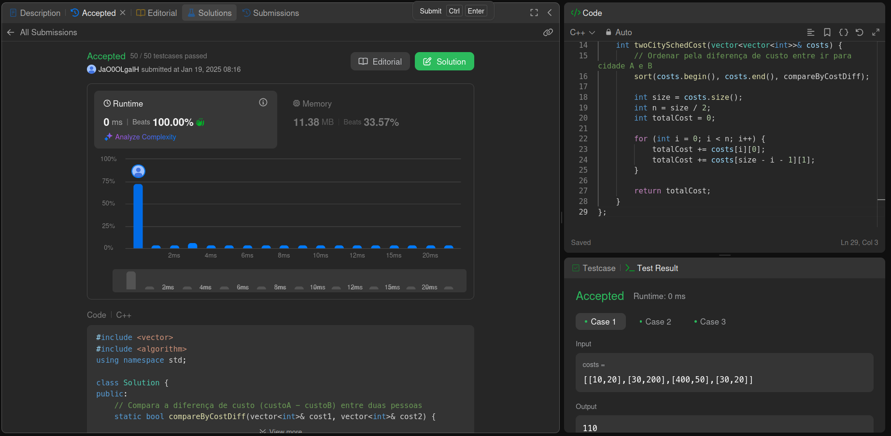

# LeetCodeProblemas

**Número da Lista**: 20 
**Conteúdo da Disciplina**: Greed 

## Alunos
| Matrícula  | Aluno                        |
| ---------- | ---------------------------- |
| 22/1021886 | Cássio Sousa dos Reis        |
| 22/1031149 | Danilo Cesar Tertuliano Melo |

## Sobre 
Este projeto tem como objetivo a resolução de exercícios da plataforma de juíz online LeetCode sobre o conteúdo de algoritmos ambiciosos (Greed).

### Questões

| Nome                                                                                       | Dificuldade |
| ------------------------------------------------------------------------------------------ | ----------- |
| [630. Course Schedule III](https://leetcode.com/problems/course-schedule-iii/description)  | Difícil     |
| [1029. Two City Scheduling](https://leetcode.com/problems/course-schedule-iii/description) | Médio       |

## Screenshots

### 630. Course Schedule III

### 1029. Two City Scheduling

## Instalação 
**Linguagem**: xxxxxx 

## Uso 
Para rodar os códigos, primeiro acesse o site do [LeetCode](https://leetcode.com/), faça login e pesquise a questão. Depois, selecione a linguagem correta, copie e cole o código na aba "Code", e clique em "Run" para testar ou "Submit" para enviar a solução.

## Outros 
Quaisquer outras informações sobre seu projeto podem ser descritas abaixo.

